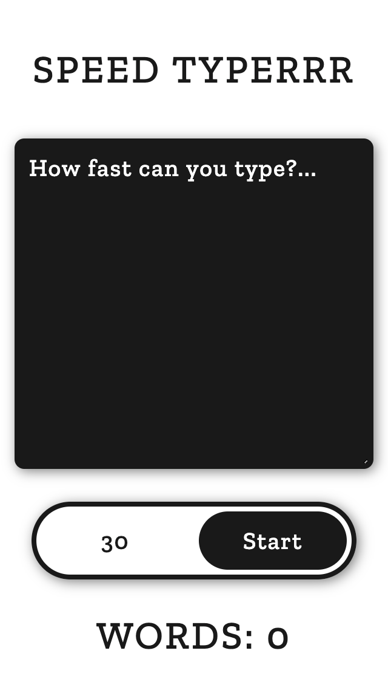
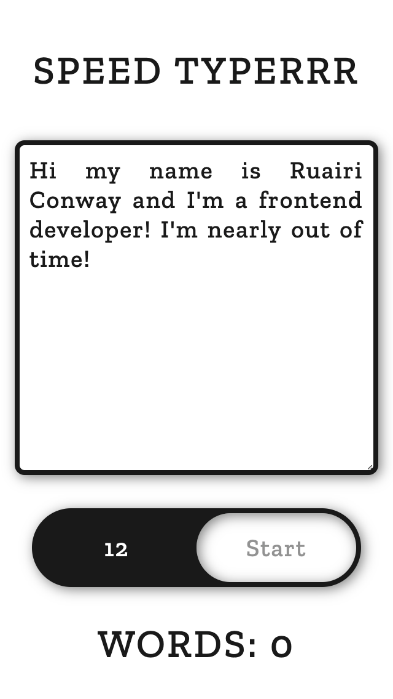
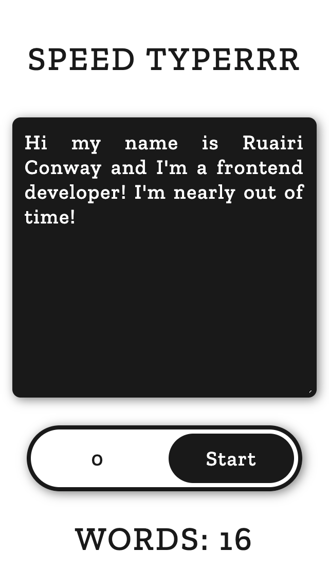

# SPEED TYPERRR

Simple react build using useState, useEffect, and useRef hooks with functional components.

## View
- Live: https://ruairiconway.github.io/speed-typerrr/
- code: https://github.com/ruairiconway/speed-typerrr

| Start | In-Progress | End |
| ---- | ---- | ---- |
|  |  |  |

## Future Edits
- Server API to help keep track of high scores!
- Mechanic to prevent copy and pasting